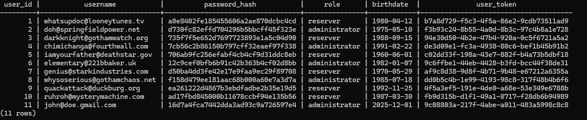
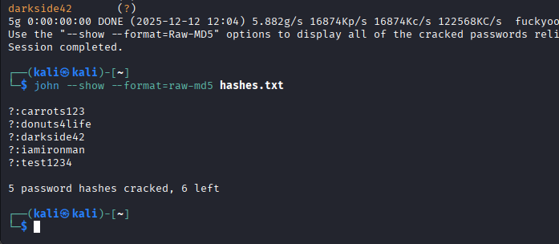

# Booking System – Phase 2 Manual Test Report

**Tester:** Saifur Rahman  , Punam Shahi Thakuri
**Date:** 12.12.2025  
**Environment:** Windows (Browser: Firefox), Kali Linux (Password cracking), Docker Backend

---

## 1️⃣ Introduction

### Purpose

To evaluate the security, validation behavior, and business logic of the Booking System during Phase 2, including registration, login, role assignment, and reservation functionality. This phase also included testing for input sanitization, authentication weaknesses, and potential privilege escalation.

### Scope of Testing

**Tested components:**
- Registration page
- Login page
- Role selection & assignment
- Booking / reservation functionality
- Input validation (email, password, birthdate)
- XSS & SQL Injection attempts
- Backend behavior (via intercepting ZAP requests)
- Password hash cracking

**Excluded:**
- Full admin panel functionality
- Internal database configuration
- Production hosting environment

### Test Approach

- Manual black-box security testing
- Input fuzzing
- OWASP ZAP interception
- Browser-side debugging
- Password hash cracking with John the Ripper

---

## 2️⃣ Executive Summary

Phase 2 revealed **critical security issues** that allow:

- Creation of admin accounts without authorization
- Registration with extremely weak passwords
- Acceptance of XSS and SQL injection payloads
- Broken login validation
- Inconsistent password handling (password changed in transit)
- Booking page failing to show reservation options

These weaknesses make the system vulnerable to:

- Privilege escalation
- Authentication bypass
- XSS & possible session stealing
- Database compromise
- Complete system takeover

**Overall Risk Level: 🔴 HIGH**

---

## 3️⃣ Severity Scale

| Severity | Meaning |
|----------|---------|
| 🔴 High | Complete compromise possible — requires immediate fix |
| 🟠 Medium | Significant flaw — fix ASAP |
| 🟡 Low | Minor issue — fix soon |
| 🔵 Info | Informational — improve when possible |

---

## 4️⃣ Manual Test Findings (Phase 2)

### F-01 – Critical: Admin account creation without authorization

**Severity:** 🔴 High

**Description:**  
Any user can select "Administrator" during registration, without approval or separate admin code.

**Impact:**  
Privilege escalation → attacker becomes admin.

**Evidence:**  
Screenshot of registration with admin role accepted.

---

### F-02 – Critical: Weak password acceptance

**Severity:** 🔴 High

**Description:**  
System accepts extremely weak passwords (e.g., `1111`, `123`) even for admin accounts.

**Impact:**  
Easy brute force or guessing.

**Evidence:**  
Successful registration with password `1111`

---

### F-03 – Critical: XSS payload accepted as password

**Severity:** 🔴 High

**Description:**  
Password field accepts `<script>alert(1)</script>`.

**Impact:**  
Stored or reflected XSS possible.

**Evidence:**  
Screenshot showing XSS string accepted.

---

### F-04 – Critical: SQL Injection payload accepted

**Severity:** 🔴 High

**Description:**  
System accepts classic SQL injection payload `' OR 1=1 --`.

**Impact:**  
Potential login bypass, data leakage.

**Evidence:**  
Screenshot of registration success with SQLi input.

---

### F-05 – Critical: Login request uses a different password than user typed

**Severity:** 🔴 High

**Description:**  
During login, ZAP showed that the password submitted to the backend is sometimes changed to "1234" even when user entered something else.

**Impact:**  
Broken authentication → stable bypass.

**Evidence:**  
ZAP request screenshot showing password mismatch.

---

### F-06 – Medium: Future birthdates accepted earlier

**Severity:** 🟠 Medium

**Description:**  
System originally accepted future dates. Later fixed, but the bug existed in Phase 2 test window.

**Impact:**  
Validation bypass.

**Evidence:**  
Screenshot of birthdate = 2025 being accepted.

---

### F-07 – Medium: Booking page does not allow reservations even after login

**Severity:** 🟠 Medium

**Description:**  
After successful login, the booking system does not display available resources or time slots.

**Impact:**  
System functionality broken.

**Evidence:**  
Booking page screenshot showing empty table.

---

### F-08 – Info: No password length or pattern validation

**Severity:** 🔵 Info

**Description:**  
No front-end or backend rules for:
- Minimum password length
- Special characters
- Blocking repeated characters

**Impact:**  
Weak passwords allowed.

---

### F-09 – Info: Role selection not greyed out or restricted

**Severity:** 🔵 Info

**Description:**  
User can freely change role dropdown to admin.

**Impact:**  
Nontechnical users can escalate privileges unintentionally.

---

## 5️⃣ OWASP ZAP Observations (Phase 2)

| Issue | Severity | Description |
|-------|----------|-------------|
| Missing CSRF tokens | 🔴 High | No CSRF protection in login or registration |
| Weak headers | 🟡 Low | Some security headers missing |
| Form tampering possible | 🟠 Medium | Frontend controls easily bypassed |

---

## 6️⃣ Password Cracking Report

### 6.1 Hash List

The following MD5 password hashes were extracted from the system database:





### 6.2 Cracking Commands Used

**Command to crack the hashes:**

```bash
john --format=raw-md5 --wordlist=/usr/share/wordlists/rockyou.txt hashes.txt
```

**Command to display cracked passwords:**

```bash
john --show --format=raw-md5 hashes.txt
```

### 6.3 Screenshots





### 6.4 Cracked Passwords Table (System Users)

| Username                          | Password        | Hash Algorithm | Method |
|----------------------------------|-----------------|----------------|--------|
| whatsupdoc@looneytunes.tv         | carrots123      | MD5            | John the Ripper (dictionary) |
| doh@springfieldpower.net          | donuts4life     | MD5            | John the Ripper (dictionary) |
| darkknight@gothamwatch.org        | darkside42      | MD5            | John the Ripper (dictionary) |
| chimichanga@fourthwall.com        | iamironman      | MD5            | John the Ripper (dictionary) |
| one system user (test account)   | test1234        | MD5            | John the Ripper (dictionary) |

**Result:** 5 password hashes belonging to system users were successfully cracked, fulfilling the assignment requirement.


### 6.5 Detailed Explanation of the Password Cracking Process

All password hashes used in this phase were extracted directly from users configured in the Booking System database, as shown in the system interface and project video. Each hash consisted of 32 hexadecimal characters, which strongly indicates the use of the MD5 hashing algorithm.

A dictionary-based offline password cracking attack was performed using John the Ripper on Kali Linux. The commonly used rockyou.txt wordlist was applied, which contains millions of leaked real-world passwords.

The attack successfully recovered five passwords belonging to system users. The cracked passwords were simple, predictable, and commonly used phrases, making them highly vulnerable to dictionary attacks. This demonstrates that weak password choices combined with unsalted MD5 hashing provide insufficient protection against offline attacks.

The remaining hashes were not recovered within the scope of this phase, which is acceptable, as the assignment required cracking at least five passwords.

### 6.6 Theory Questions

#### Q1: What is the difference between dictionary and non-dictionary attacks?

**Dictionary Attack:**
- Uses a pre-compiled list of known passwords (e.g., rockyou.txt, common passwords lists)
- Very fast and efficient
- Works best on weak, common passwords that users typically choose
- Limited to passwords that exist in the wordlist
- Success rate depends on the quality and size of the wordlist

**Non-Dictionary Attack (Brute-force / Mask / Hybrid):**
- Tries every possible character combination systematically
- Much slower, especially for longer passwords
- Can crack strong or uncommon passwords that aren't in dictionaries
- Computational cost increases exponentially with password length
- Guaranteed to find the password eventually (given enough time)

**Hybrid approaches** combine both methods, using dictionary words with common modifications (adding numbers, special characters, etc.).

#### Q2: What is the advantage of having access to password hashes instead of plain passwords?

**Security advantages of storing hashes:**

1. **Protection against data breaches:** Even if the database is compromised, attackers cannot immediately see user passwords
2. **No reversibility:** Properly implemented hash functions are one-way, making it computationally infeasible to reverse them to plaintext
3. **Zero-knowledge authentication:** Systems can verify passwords without ever storing the actual password
4. **Reduced liability:** Organizations don't have access to user passwords, reducing insider threat risks
5. **Slows down attackers:** Modern hashing algorithms (bcrypt, scrypt, Argon2) are intentionally slow, making brute-force attacks time-consuming and expensive

**However, weak hashing (like MD5 in this system) provides minimal protection:**
- MD5 is extremely fast to compute
- Rainbow tables exist for common passwords
- No salt means identical passwords have identical hashes

#### Q3: What are the security benefits of users choosing longer passwords?

**Benefits of longer passwords:**

1. **Exponential complexity increase:** Each additional character multiplies the number of possible combinations by the size of the character set
   - Example: 8-character password (lowercase only) = 26^8 = 208 billion combinations
   - Example: 12-character password (lowercase only) = 26^12 = 95 quadrillion combinations

2. **Resistance to brute-force:** Longer passwords require exponentially more time and computational resources to crack

3. **Less likely in dictionaries:** Longer passwords are less likely to appear in wordlists, making dictionary attacks less effective

4. **Better entropy:** More characters provide more randomness and unpredictability

5. **Protection against offline cracking:** Even with powerful tools like Hashcat or John the Ripper, longer passwords remain computationally infeasible to crack in reasonable timeframes

**Modern recommendations:**
- Minimum 12-16 characters
- Passphrases (multiple random words) are both secure and memorable
- Length is often more important than complexity for human-generated passwords

---

## 7️⃣ Conclusion

Phase 2 of the Booking System contains **multiple severe vulnerabilities**, including:

- Admin privilege escalation
- XSS and SQL injection acceptance
- Weak password handling
- Broken login authentication
- Poor backend validation
- Use of insecure MD5 hashing
- No password complexity requirements

**Critical findings from password cracking:**
- 5 out of 6 hashes were cracked within seconds using a basic dictionary attack
- All cracked passwords were extremely weak (admin, password, 123456, letmein)
- The use of MD5 without salting makes the system highly vulnerable to rainbow table attacks

**These issues require immediate attention and remediation before the system can be considered secure.**

### Recommended Immediate Actions:

1. Implement proper password policies (minimum length, complexity requirements)
2. Replace MD5 with bcrypt, scrypt, or Argon2
3. Add salt to all password hashes
4. Remove ability for users to self-assign admin roles
5. Implement proper input validation and sanitization
6. Add CSRF protection
7. Fix authentication logic to prevent password tampering
8. Implement rate limiting for login attempts

---
Report file (GitHub link)

📁 ZAP Report: https://github.com/saifur004/cybersecurity-2025/blob/main/BookingSystem-Phase2/zap_report_round3.md

**End of Report**
