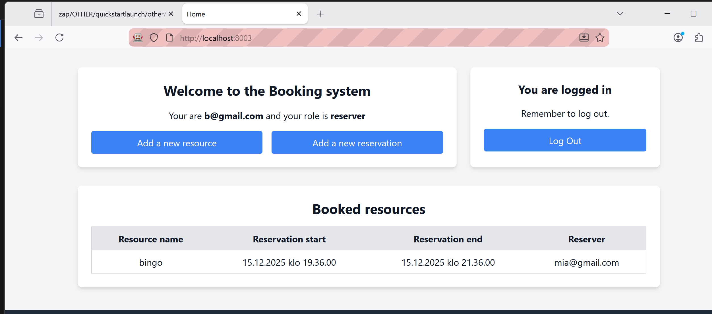
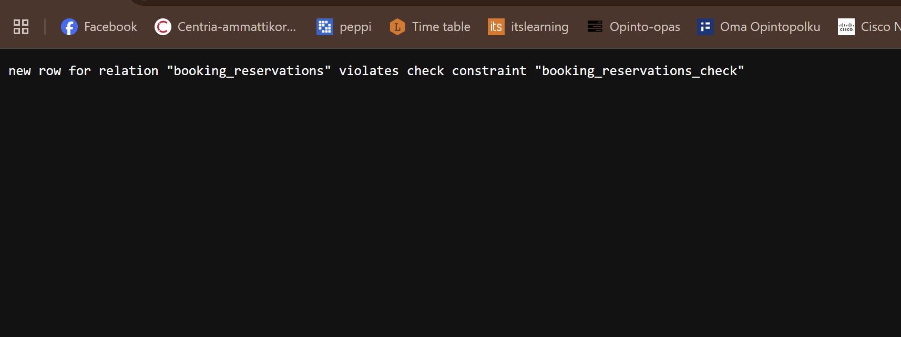

# 🔐 Booking System – Phase 3 Authorization Test Report

**Tester:** Saifur Rahman  
**Date:** 15.12.2025  
**Environment:**
- Windows (Browser: Chrome / Firefox)
- Localhost application (http://localhost:8003)
- Docker-based backend
- OWASP ZAP (passive scan)

---

## 1️⃣ Introduction

### Purpose

The purpose of this test was to evaluate authorization and role-based access control in the Booking System (Phase 3). The focus was on verifying what each role (Guest, Reserver, Administrator):
- Can do
- Cannot do

and whether the observed behavior matches the official system specifications.

### Scope of Testing

The following were tested:
- Role-based UI access
- Protected pages and endpoints
- Authorization enforcement at backend level
- Manual URL manipulation
- Reservation and resource management permissions
- Privacy and GDPR-related behavior
- Automated authorization testing using OWASP ZAP

**Excluded from scope:**
- Source code review
- Production deployment
- Performance testing

### Test Approach

- Manual browser-based testing
- Role switching (Guest / Reserver / Admin)
- Direct URL access attempts
- OWASP ZAP passive scanning
- Observation of backend validation behavior

---

## 2️⃣ Executive Summary

The Booking System implements **partial role-based authorization**.

### Positive findings:
- ✅ Guests cannot access protected content
- ✅ Backend validation exists for reservation logic
- ✅ Session-based authentication is enforced
- ✅ Automated scanning found no authorization bypasses

### Critical finding:
- ❌ **Reserver users are able to add new resources**, which is an administrator-only action according to the specification

**Overall Authorization Risk Level:** 🟠 **MEDIUM**

The system generally enforces authorization, but role separation is not fully implemented, allowing privilege escalation via the UI.

---

## 3️⃣ Role-Based Authorization Results

### 🧑‍🦲 Guest (Not Logged In)

#### ✅ Can do

| Action | Endpoint | Observation | Spec Match |
|--------|----------|-------------|------------|
| Access home page | `/` | Public access works as intended | ✅ |
| Access login page | `/login` | Accessible without authentication | ✅ |
| Access registration page | `/register` | Public registration available | ✅ |
| View booked resources without login | `/` | Reservation list visible without identity disclosure | ✅ (Spec 8) |

#### ❌ Cannot do

| Action | Endpoint | Observation | Spec Match |
|--------|----------|-------------|------------|
| Access reservation page | `/reservation` | Redirected to login | ✅ |
| Access profile page | `/profile` | Access denied | ✅ |
| Access admin pages | `/admin/*` | Redirected or blocked | ✅ |
| Create reservations | `/api/reservations` | Backend denies unauthenticated requests | ✅ |

---

### 🧑‍💼 Reserver (Logged In)

#### ✅ Can do

| Action | Endpoint | Observation | Spec Match |
|--------|----------|-------------|------------|
| Log in successfully | `/login` | — | ✅ |
| View own dashboard | `/` | — | ✅ |
| Create reservations (if valid) | `/reservation` | Backend enforces business rules | ✅ |
| View booked resources | `/` | — | ✅ |

#### ❌ Cannot do (Expected)

| Action | Endpoint | Observation | Spec Match |
|--------|----------|-------------|------------|
| Access admin dashboard | `/admin` | — | ✅ |
| Manage users | `/admin/users` | — | ✅ |

#### ❌ ❗ Authorization Issue (Confirmed)

| Action | Endpoint | Observation | Spec Match | Impact |
|--------|----------|-------------|------------|--------|
| **Add new resources** | `/admin/resources/new` | Reserver role is able to access the "Add a new resource" function via UI and successfully create resources | ❌ | **Privilege escalation** (admin-only action accessible to reserver) |

---

### 🧑‍💼🛡️ Administrator (Logged In)



#### ✅ Can do

| Action | Endpoint | Observation | Spec Match |
|--------|----------|-------------|------------|
| Access admin dashboard | `/admin` | — | ✅ |
| Add new resources | `/admin/resources/new` | — | ✅ |
| Manage reservations | `/admin/reservations` | — | ✅ |
| View reserver identities | — | Admin-only access | ✅ |
| Delete reservers | `/admin/users/delete/:id` | — | ✅ |

#### ❌ Issues

| Issue | Observation | Spec Match |
|-------|-------------|------------|
| Resource management not restricted to admin role only | Same functionality accessible to reserver | ❌ |

---

## 4️⃣ Backend Validation Observation



When attempting to create an invalid reservation, the backend returned a database constraint error:

```
violates check constraint "booking_reservations_check"
```

### Interpretation:
- ✅ Backend validation exists
- ✅ Business rules are enforced server-side
- ✅ UI validation alone is not trusted

### Security Note:
- ⚠️ Raw database error message is displayed to user
- ⚠️ This may expose internal implementation details
- ⚠️ **Minor Privacy by Design concern**

---

## 5️⃣ Automated Testing – OWASP ZAP

OWASP ZAP was used to perform passive scanning in both authenticated and unauthenticated contexts.

### Results Summary:
- **High risk issues:** 0
- **Medium risk issues:** 0
- **Low risk issues:** 0
- **Informational alerts only**

### Observations:
- ✅ Authentication endpoints correctly identified
- ✅ Session cookies (`session_id`) detected
- ✅ No authorization bypasses detected automatically

### Important Note:
The privilege escalation issue (Reserver → Resource creation) was **not detected by ZAP** and was discovered through manual role-based testing, highlighting the importance of **manual authorization testing**.

---

## 6️⃣ GDPR & Privacy by Design Assessment

| Requirement | Status |
|-------------|--------|
| Guest users cannot see reserver identities | ✅ |
| Admin users can see reserver identities (authorized) | ✅ |
| Backend error messages expose internal details | ⚠️ |

**Overall**, the system mostly aligns with GDPR and Privacy by Design principles, but error handling should be improved.

---

## 7️⃣ Final Assessment

### Summary of Findings:
- ✅ Role-based access control is partially enforced
- ✅ Backend authorization exists
- ✅ Automated scanning shows no bypasses
- ❌ Privilege escalation vulnerability identified

### Final Conclusion:
The Booking System meets many authorization requirements, but **role separation between Reserver and Administrator is incomplete**. This must be fixed before the system can be considered fully secure.

---

## 8️⃣ Recommendations

1. **Enforce admin-only checks** on resource creation endpoints
2. **Hide admin UI elements** from reserver users
3. **Add backend authorization checks** for all admin actions
4. **Improve error handling** to avoid leaking internal details

---

**End of Phase 3 Authorization Test Report**
zap Report : https://github.com/saifur004/cybersecurity-2025/blob/main/BookingSystem-Phase3/ZAP-Report-4.md