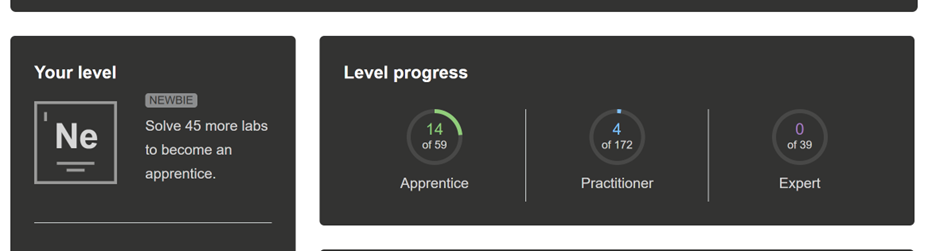

# Cybersecurity and Data Privacy Course - Final Report

## Student Information
**Course:** Cybersecurity and Data Privacy  
**Total Hours:** 93 hours  
**Repository:** [https://github.com/saifur004/cybersecurity-2025](https://github.com/saifur004/cybersecurity-2025)

---

## 1. PortSwigger Web Security Academy

### Completed Labs: 18 Total

#### SQL Injection (4 labs)
- WHERE clause allows retrieval of hidden data
- Login bypass using SQL injection
- Union-based SQL injection
- Authentication bypass via SQL injection

#### Authentication (5 labs)
- Username enumeration via response differences
- Password reset logic flaw
- Broken brute-force protection
- 2FA simple bypass
- Password-based login vulnerable to SQL injection

#### Access Control (7 labs)
- Unprotected admin functionality
- Insecure direct object reference (IDOR)
- User role modification via IDOR
- Horizontal privilege escalation
- Vertical privilege escalation
- Method-based access control bypass
- URL-based access restriction bypass

#### Business Logic (2 labs)
- Excessive trust in client-side controls
- Low-level logic flaw exploitation

### Key Outcomes
These labs provided hands-on experience with real-world vulnerabilities and common developer security mistakes aligned with OWASP Top 10.

---

## 2. Booking System Security Assessment

### Phase 1: Baseline Security Testing (20 hours)

**Objective:** Understand the application and perform initial security testing

**Activities:**
- Manual testing of authentication, input validation, and session handling
- OWASP ZAP baseline scanning
- Vulnerability documentation with reproduction steps

**Results:**
- ✅ Manual testing identified missing access restrictions and weak validation
- ✅ ZAP highlighted potential risk areas
- ❌ Automated scanning missed logic flaws and authorization issues

**Key Learning:** Automated tools are useful for discovery, but manual analysis is essential for meaningful results.

---

### Phase 2: Advanced Exploitation (8 hours)

**Objective:** Perform deep security testing and exploitation

**Activities:**
- SQL injection and XSS payload testing
- HTTP request interception with OWASP ZAP
- Privilege escalation attempts
- Password hash extraction and cracking with John the Ripper

**Results:**
- ✅ Request interception exposed backend logic flaws
- ✅ Successfully compromised accounts through hash cracking
- ❌ Some payloads required tuning due to backend filtering

**Key Learning:** Small security misconfigurations can lead to complete system compromise.

---

### Phase 3: Authorization Testing (10 hours)

**Objective:** Test role-based access control and data exposure

**Activities:**
- User role testing (user, manager, admin)
- Manual URL manipulation
- Exposed endpoint review
- Passive scanning
- GDPR-related data exposure assessment

**Results:**
- ✅ Role switching revealed authorization weaknesses
- ✅ Endpoint analysis uncovered hidden admin functions
- ❌ Passive scanning insufficient for business logic vulnerabilities

**Key Learning:** Authorization flaws often pose higher risk than injection vulnerabilities.

---

### Phase 4: GDPR Compliance (5 hours)

**Objective:** Review data privacy and GDPR compliance

**Activities:**
- Data handling practices review
- GDPR compliance checklist creation
- Privacy Policy drafting
- Terms of Service development
- Cookie Policy documentation

**Results:**
- ✅ Structured GDPR framework ensured comprehensive compliance review
- ❌ Multiple privacy requirements missing from original design

**Key Learning:** Security and privacy must be integrated from the design stage, not added afterward.

---

## 3. Time Breakdown

| Activity | Hours | Percentage |
|----------|-------|------------|
| Course modules and exam | 14.5 | 15.6% |
| PortSwigger Academy labs | 18.0 | 19.4% |
| Booking System Phase 1 | 20.0 | 21.5% |
| Booking System Phase 2 | 8.0 | 8.6% |
| Booking System Phase 3 | 10.0 | 10.8% |
| Booking System Phase 4 | 5.0 | 5.4% |
| Additional exercises | 17.5 | 18.8% |
| **Total** | **93.0** | **100%** |

---

## 4. Key Skills Developed

### Technical Skills
- Manual security testing methodologies
- SQL injection exploitation techniques
- Authentication and session management testing
- Authorization and access control testing
- OWASP ZAP usage (scanning, interception, fuzzing)
- Password cracking with John the Ripper
- Vulnerability documentation and reporting

### Compliance & Privacy
- GDPR compliance assessment
- Privacy by Design principles
- Privacy policy development
- Data protection documentation

---

## 5. Critical Insights

### What I Learned

1. **Automated vs Manual Testing**  
   Automated tools are valuable for initial discovery but cannot replace manual testing for logic flaws and authorization issues.

2. **Authorization > Injection**  
   Access control vulnerabilities often have greater impact than injection flaws, yet receive less attention during development.

3. **Privacy by Design**  
   Retrofitting privacy controls is significantly harder than integrating them from the start. Security and privacy must be design principles, not afterthoughts.

4. **Documentation Matters**  
   Clear vulnerability documentation with reproduction steps is essential for effective remediation.

---

## 6. Final Reflection

This course provided comprehensive practical experience in web application security and data privacy. The combination of PortSwigger labs and the booking system project effectively bridged theory and practice.

The PortSwigger labs built foundational knowledge of common vulnerabilities, while the multi-phase booking system project simulated real-world penetration testing. Testing authorization boundaries and understanding GDPR compliance requirements were particularly valuable.

I now have strong confidence in identifying, analyzing, and documenting security vulnerabilities in a structured and professional manner. The emphasis on both security and privacy creates a well-rounded perspective essential for modern application development.

---

## 7. Course Feedback

**Strengths:**
- Well-balanced between theory and hands-on practice
- Booking system project effectively simulated real-world scenarios
- Progressive difficulty curve supported skill development

**Suggestions for Improvement:**
- More guided examples on advanced authorization testing techniques
- Additional resources on API security testing
- Case studies of real-world data breaches and lessons learned

---

## Appendices

### A. Repository Contents
- PortSwigger lab completion screenshots
- Booking system vulnerability reports
- GDPR compliance documentation
- Privacy Policy, Terms of Service, Cookie Policy
- Detailed time tracking logs

### B. Tools Used
- OWASP ZAP (automated scanning, request interception, fuzzing)
- John the Ripper (password cracking)
- Browser Developer Tools
- Git/GitHub